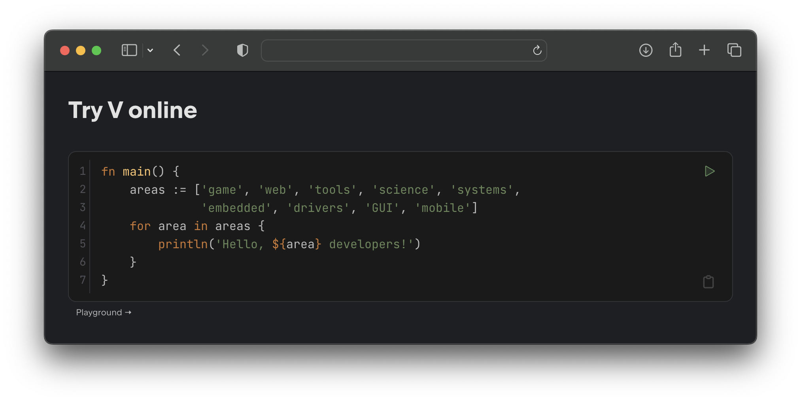

# V Playground Component

[![Association Official Project][AssociationOfficialBadge]][AssociationUrl]
[![NPM version][NpmVersionBadge]][NpmUrl]



Component that creates V-aware editors capable of running code from HTML block elements.
It uses [V Playground](https://play.vosca.dev) as a backend.
Backend sources can be found
in [V Playground repository](https://github.com/vlang-association/playground).

## Installation

### Use CDN

Insert a `<script>` element into your page and specify what elements should be converted in
its `data-selector` attribute.

```html
<script src="https://unpkg.com/vlang-playground@1" data-selector="code"></script>
```

Add css to your page:

```html
<link rel="stylesheet" href="https://unpkg.com/vlang-playground@1/dist/vlang-playground.css">
```

Mostly inspired by [Kotlin Playground](https://github.com/JetBrains/kotlin-playground).

## License

This project is under the **MIT License**.
See the
[LICENSE](https://github.com/vlang-association/playground-component/blob/master/LICENSE)
file for the full license text.

[AssociationOfficialBadge]: https://vosca.dev/badge.svg

[NpmVersionBadge]: https://img.shields.io/npm/v/vlang-playground.svg

[AssociationUrl]: https://vosca.dev

[NpmUrl]: https://www.npmjs.com/package/vlang-playground
